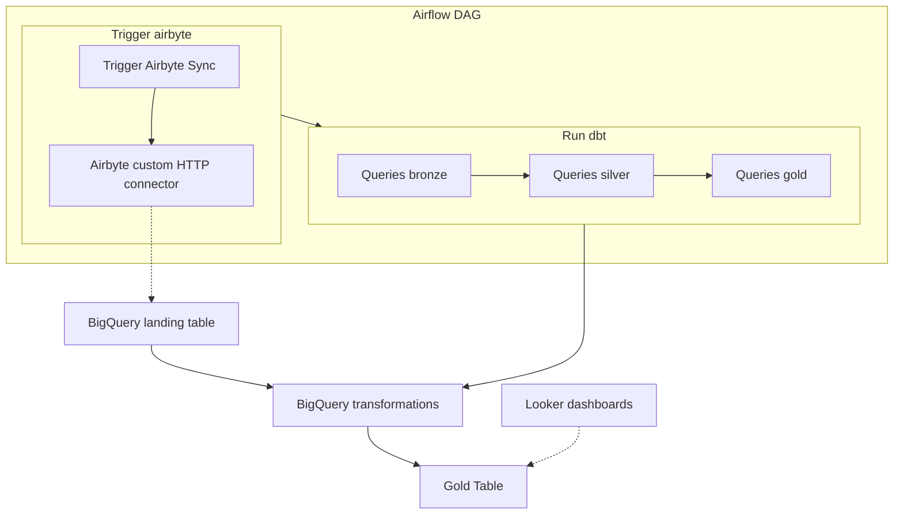

# 📊 Data Pipeline - Paris Events

    

## 📌 Description
This project builds a data pipeline to collect, transform, and visualize **Paris events** using **Airbyte, dbt, BigQuery, and Looker Studio**. The entire process is orchestrated via **Airflow** for automated updates.
**Public Dashboard Link**: [Looker Studio Dashboard](https://lookerstudio.google.com/s/owd516emkqk)

---

## 🏗️ **Pipeline Architecture**



1️⃣ **Data Ingestion**:
   - Source: **Paris OpenData API** ([opendata.paris.fr](https://opendata.paris.fr/explore/dataset/que-faire-a-paris-/information/?disjunctive.access_type&disjunctive.price_type&disjunctive.deaf&disjunctive.blind&disjunctive.pmr&disjunctive.address_city&disjunctive.address_zipcode&disjunctive.address_name&disjunctive.tags&disjunctive.programs&dataChart=eyJxdWVyaWVzIjpbeyJjaGFydHMiOlt7InR5cGUiOiJjb2x1bW4iLCJmdW5jIjoiQ09VTlQiLCJ5QXhpcyI6InBtciIsInNjaWVudGlmaWNEaXNwbGF5Ijp0cnVlLCJjb2xvciI6IiNGRkNEMDAifV0sInhBeGlzIjoidXBkYXRlZF9hdCIsIm1heHBvaW50cyI6IiIsInRpbWVzY2FsZSI6ImRheSIsInNvcnQiOiIiLCJjb25maWciOnsiZGF0YXNldCI6InF1ZS1mYWlyZS1hLXBhcmlzLSIsIm9wdGlvbnMiOnsiZGlzanVuY3RpdmUuYWNjZXNzX3R5cGUiOnRydWUsImRpc2p1bmN0aXZlLnByaWNlX3R5cGUiOnRydWUsImRpc2p1bmN0aXZlLmRlYWYiOnRydWUsImRpc2p1bmN0aXZlLmJsaW5kIjp0cnVlLCJkaXNqdW5jdGl2ZS5wbXIiOnRydWUsImRpc2p1bmN0aXZlLmFkZHJlc3NfY2l0eSI6dHJ1ZSwiZGlzanVuY3RpdmUuYWRkcmVzc196aXBjb2RlIjp0cnVlLCJkaXNqdW5jdGl2ZS5hZGRyZXNzX25hbWUiOnRydWUsImRpc2p1bmN0aXZlLnRhZ3MiOnRydWUsImRpc2p1bmN0aXZlLnByb2dyYW1zIjp0cnVlfX19XSwiZGlzcGxheUxlZ2VuZCI6dHJ1ZSwiYWxpZ25Nb250aCI6dHJ1ZX0%3D&basemap=jawg.dark&location=3,27.12049,1.64636))
   - Tool: **Airbyte** (HTTP API custom connector) # TODO -> swith to dlt. Do not like airbyte versioning and overkill
   - Storage: **BigQuery (landing layer)**

2️⃣ **Data Transformation**:
   - Tool: **dbt (Data Build Tool)**
   - Bronze layer: casting and testing
   - Silver layer: cleaning and structuring
   - Gold layer: analytical insights

3️⃣ **Automation & Orchestration**:
   - Tool: **Apache Airflow**
   - Scheduled daily ingestion and transformation
   - Automated dbt execution after ingestion

---

## 📂 **Repository Structure**
```
project_root/
├── airbyte/        # Airbyte connectors
├── airflow/        # Airflow DAGs and config
├── dbt_project/    # dbt models (bronze, silver, gold)
├── README.md
```

---

## 🚀 **Installation & Deployment**
### **1️⃣ Prerequisites**
- Google Cloud Platform (**BigQuery**)
- **dbt** installed and configured for BigQuery
- **Looker Studio** for data visualization
- **[Docker](https://www.docker.com/get-started)** (recommended: v24+)
- **[Docker Compose](https://docs.docker.com/compose/install/)** (recommended: v2.20+)

#### Example dbt configuration (`profiles.yml`)
```yaml
paris_events:
  target: dev
  outputs:
    dev:
      type: bigquery
      method: service-account
      project: your-gcp-project
      dataset: your_dataset
      threads: 1
      keyfile: /path/to/your/service-account.json
```

#### **dbt: Run Transformations**
```bash
dbt run
```

#### Setting Up Apache Airflow with Docker
We use **Docker Compose** to deploy **Apache Airflow** for orchestrating the data pipeline.

##### Setup Instructions
- Follow the [official Airflow Docker tutorial](https://airflow.apache.org/docs/apache-airflow/2.1.1/start/docker.html).
- Use the `start.sh` file to launch Docker easily.

##### Access the Web UI at http://localhost:8080
- Username: airflow
- Password: airflow

#### Setting Up Airbyte with abctl
See the Airbyte repository and its README for details.

#### Linking Airbyte and Airflow
Since Airbyte and Airflow run in two isolated Docker containers, you need to create a Docker network so Airflow can trigger Airbyte.

```bash
docker network create myNetwork
docker network connect myNetwork airbyte-abctl-control-plane
docker network connect myNetwork airflow-airflow-webserver-1
docker network connect myNetwork airflow-postgres-1
docker network connect myNetwork airflow-redis-1
docker network connect myNetwork airflow-airflow-triggerer-1
docker network connect myNetwork airflow-airflow-scheduler-1
docker network connect myNetwork airflow-airflow-worker-1
```

Then, create the connection in the Airflow Admin UI:
- Connection Type: Airbyte
- Host: http://airbyte-abctl-control-plane/api/public/v1/
- Client ID: Available in Airbyte.settings.application
- Client Secret: Available in Airbyte.settings.application

---

## 🛠 Troubleshooting
- **Network issues between containers**: Ensure all containers are connected to the same Docker network (`myNetwork`).
- **BigQuery authentication error**: Check the service account file path in `profiles.yml` and permissions.
- **Airbyte not responding to Airflow**: Verify the URL and credentials in the Airbyte connection in Airflow.
- **dbt run fails**: Run `dbt debug` to diagnose configuration issues.

---

## 🛠 Author & Contact
👤 **Name**: Harold Gallice  
📧 **Contact**: haroldgallice@gmail.com  
💼 **LinkedIn**: [Harold](https://www.linkedin.com/in/harold-gallice-43656212a/)

🚀 **Happy Data Engineering!**
